# getou_ — Journal Export

> **⚠️ Manual Horizons Review Required**
>
> This project requires manual review because the hours were originally submitted through Fallout.

- Exported at: 2026-07-09T12:02:50Z
- Project ID: 160
- Entries: 21

---

## Entry 1

- ID: 48
- Author: the rekrap2 wannabe gnahiak2 aka kaihang for my irl friends
- Created At: 2026-03-13T11:59:25Z

### Content

I set up and got the github repo up and running had to start from scratch what the hell am i writing

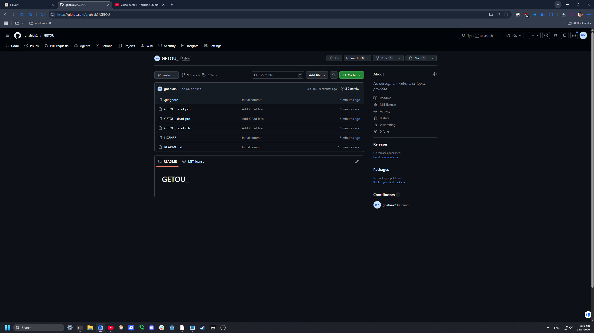

### Recording 

https://github.com/user-attachments/assets/4b639580-15e1-40c8-b246-9e96daf230af

---

## Entry 2

- ID: 53
- Author: the rekrap2 wannabe gnahiak2 aka kaihang for my irl friends
- Created At: 2026-03-14T02:09:29Z

### Content

I added all the keyboard switches and the Raspberry Pi Pico on the KiCad schematic and I decided that it would be an 80% keyboard.

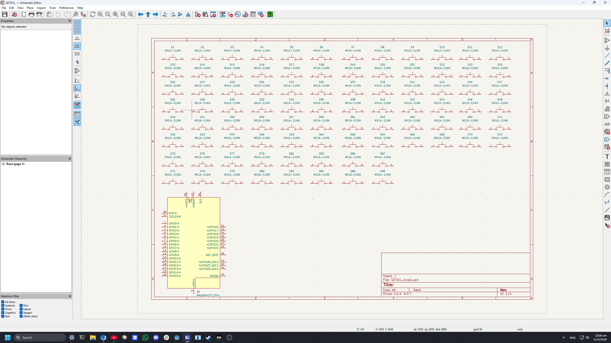

### Recording 

https://github.com/user-attachments/assets/0304c561-d2d8-4682-a607-d05a755fb6cb

---

## Entry 3

- ID: 59
- Author: the rekrap2 wannabe gnahiak2 aka kaihang for my irl friends
- Created At: 2026-03-14T10:54:38Z

### Content

Decided that it would be a small 12-key macropad instead of a full keyboard. Also zoned out a bit. Finished wiring.

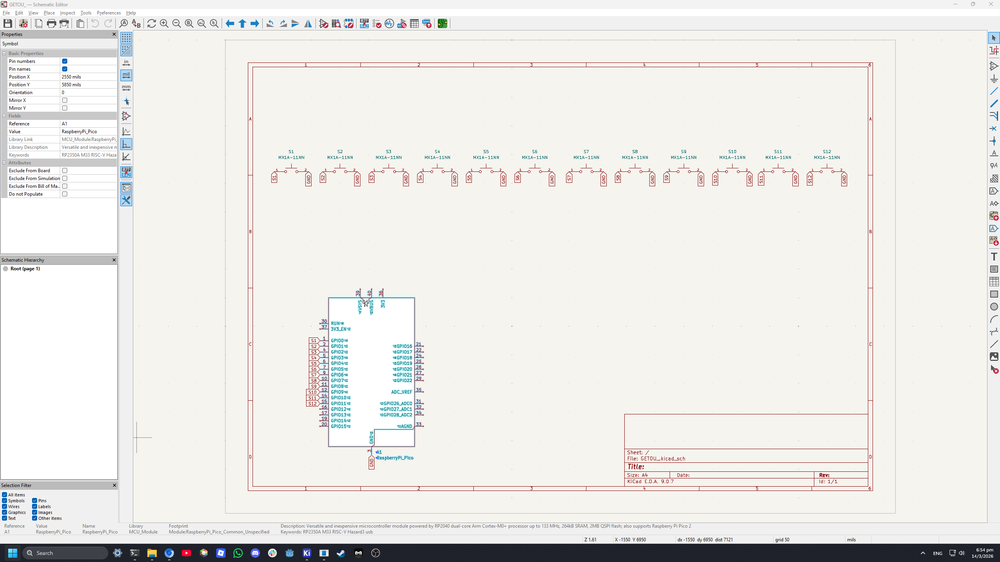

### Recording 

https://github.com/user-attachments/assets/1639315a-9482-4908-b2d0-b0e70101180c

---

## Entry 4
- ID: 72
- Author: the rekrap2 wannabe gnahiak2 aka kaihang for my irl friends
- Created At: 2026-03-15T03:32:32Z

### Content

I decided to use the xiao rp2040 instead of a full rpi pico to save space and have usb-c also finished the pcb
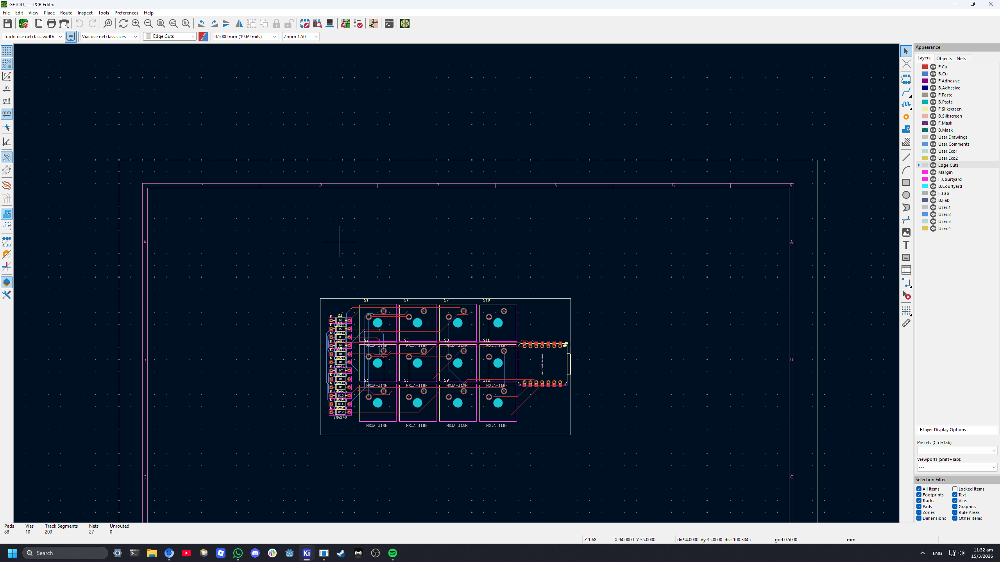

### Recording 

https://github.com/user-attachments/assets/4867f539-38f7-45d7-9d5a-e228a84de5b1

---

## Entry 5
- ID: 101
- Author: the rekrap2 wannabe gnahiak2 aka kaihang for my irl friends
- Created At: 2026-03-16T09:32:17Z

### Content

Modified pcb and added step files and started on the cad and reorgainised the folder structure in the github repo to add the cad files and in future add the firmware and the accompanying electron app for cross compatibility

### Recording 

https://github.com/user-attachments/assets/ec99dafa-c7b5-4260-951f-62c1e7c2d4cf

https://github.com/user-attachments/assets/fa566024-ea0b-4e36-9556-6b5e3177ba28

## Entry 6
- ID: 108
- Author: the rekrap2 wannabe gnahiak2 aka kaihang for my irl friends
- Created At: 2026-03-17T02:28:38Z

### Content

Finished the cad model and organised the folder structure in the github repositiory and started on firmware
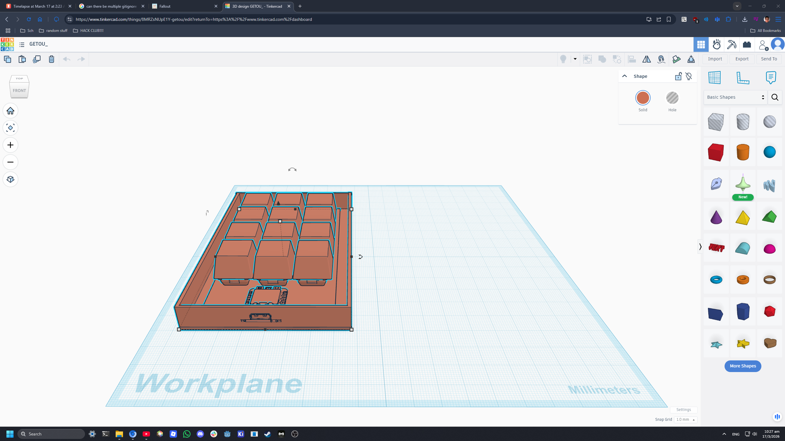

### Recording

https://github.com/user-attachments/assets/b2bd104a-e59b-4ae0-aa98-b4a15d81e535

https://github.com/user-attachments/assets/d535f8d9-37cd-48d7-b522-049e62d94f70

https://github.com/user-attachments/assets/d98586f5-090e-4fba-b04d-b625a27149b7

## Entry 7
- ID: 691
- Author: the rekrap2 wannabe gnahiak2 aka kaihang for my irl friends
- Created At: 2026-03-30T04:09:06Z

### Content

No idea what I did .......................................................................................................................................................... lowkey forgot
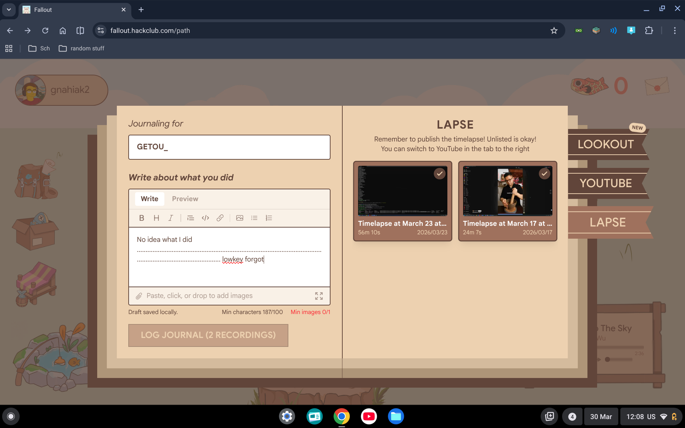

### Recordings

https://github.com/user-attachments/assets/20d60407-0aa7-4c38-bae7-f1570aa79f44

https://github.com/user-attachments/assets/3be20f10-ac1c-4316-b24c-705cacbfd279

## Entry 8
- ID: 1101
- Author: the rekrap2 wannabe gnahiak2 aka kaihang for my irl friends
- Created At: 2026-04-04T04:42:05Z

### Content

I started on the improved readme and setting up cuz i reset my pc. I also did some stuff.......................
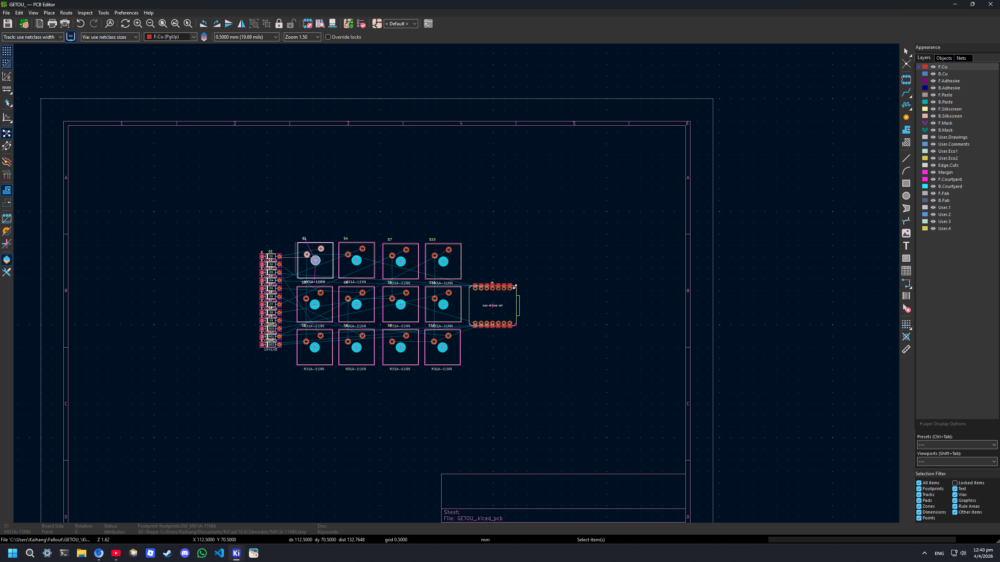

### Recording Links

- https://lookout.hackclub.com/api/media/e1c73dba-0156-41c3-a891-6a51f7b73b25/video.mp4

## Entry 9
- ID: 3855
- Author: the rekrap2 wannabe gnahiak2 aka kaihang for my irl friends
- Created At: 2026-04-25T11:07:38Z

### Content

Started on the QMK firmware and did some configuration on everything also json was from chatgpt cuz no idea....
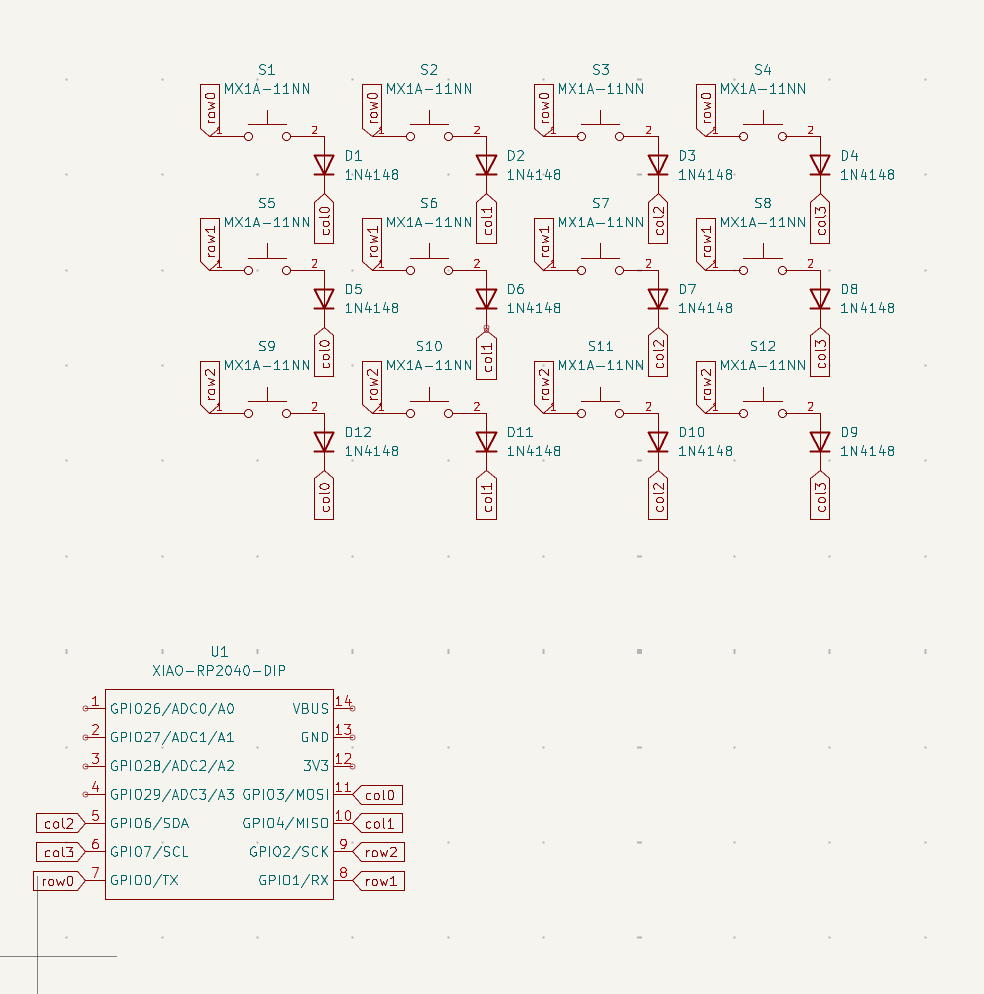

### Recordings

https://github.com/user-attachments/assets/58b35025-8b91-4782-9a79-96f5e5664cfa

https://github.com/user-attachments/assets/a2fd0a02-180a-4dae-baac-f860e5d20511

https://github.com/user-attachments/assets/b7c51d54-2e79-4df7-bc8b-14ab148d6bf0

https://github.com/user-attachments/assets/c169091b-15d7-4152-9545-822c181068a4

## Entry 10
- ID: 4034
- Author: the rekrap2 wannabe gnahiak2 aka kaihang for my irl friends
- Created At: 2026-04-26T12:34:39Z

### Content

Welp i redid qmk with some help from chatgpt cuz no idea as usual and hi soup (also we need lore on soup)
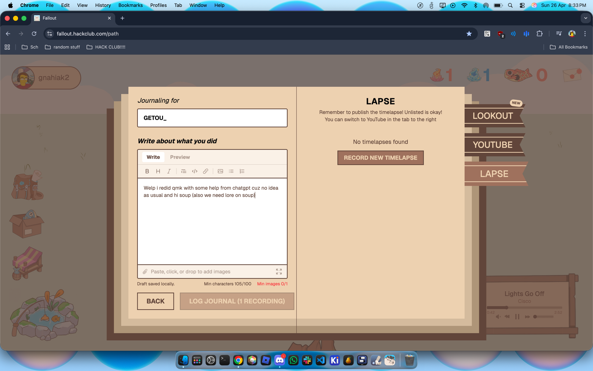

### Recording

https://github.com/user-attachments/assets/b06ecf86-e657-4ad3-b0d8-4860a4292321

## Entry 11
- ID: 4207
- Author: the rekrap2 wannabe gnahiak2 aka kaihang for my irl friends
- Created At: 2026-04-27T10:59:03Z

### Content

What i did was do some keystuff and rewire the pcb also don't mind the yt shorts i was locked in ;).
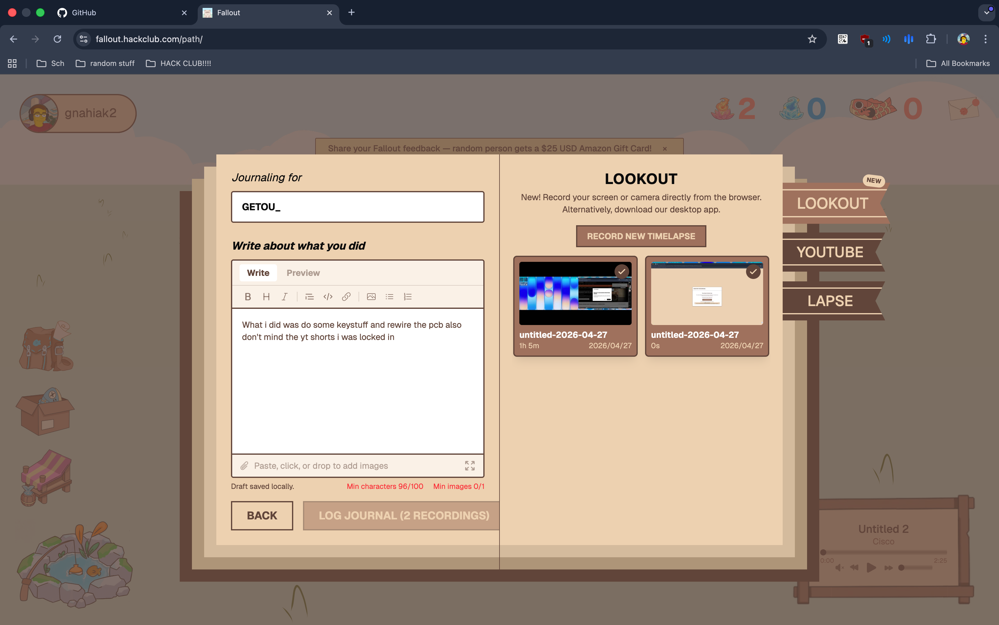

### Recordings

https://github.com/user-attachments/assets/ef5cb9c3-597d-4b90-af90-1d3896d78c02

https://github.com/user-attachments/assets/15558251-3dbf-483d-94d6-2b365def775c

## Entry 12
- ID: 5095
- Author: the rekrap2 wannabe gnahiak2 aka kaihang for my irl friends
- Created At: 2026-05-02T11:25:44Z

### Content

I mostly did qmk and some redesigns to the pcb and schematic also i FOUND OUT THAT THE WHOLE TIME MY MACROPAD WAS 4x3 NOT 3x4 LIKE I WANTED IT TO
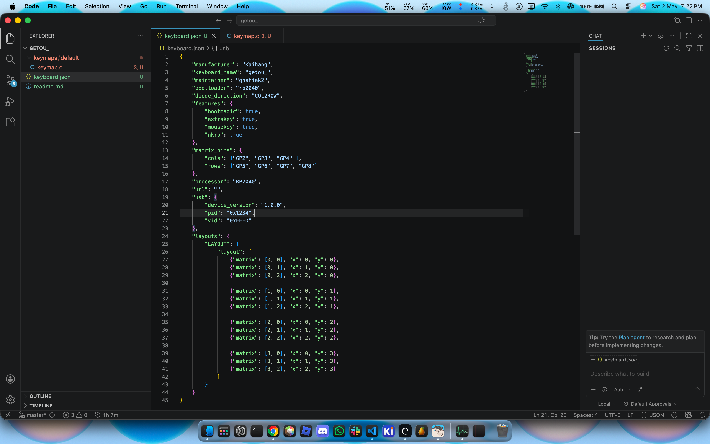

### Recording Links

https://github.com/user-attachments/assets/6ad589a9-ed97-4621-8796-5ca4ea68abfe

https://github.com/user-attachments/assets/ced72bab-8d82-4099-8e41-81d44980d9dc

## Entry 13
- ID: 5423
- Author: the rekrap2 wannabe gnahiak2 aka kaihang for my irl friends
- Created At: 2026-05-04T12:28:42Z

### Content

I redid my pcb and started on my Bill of Materials which was ermm no idea but i did finish my PCB which was a pain

### Recording

https://github.com/user-attachments/assets/6f78a9d8-e6f8-4f67-bf3f-dbfac2a7f3d1

## Entry 14
- ID: 7381
- Author: the rekrap2 wannabe gnahiak2 aka kaihang for my irl friends
- Created At: 2026-05-16T07:56:00Z

### Content

I locked in cuz i locked in and locked in some moreI locked in cuz i locked in and locked in some moreI locked in cuz i locked in and locked in some moreI locked in cuz i locked in and locked in some moreI locked in cuz i locked in and locked in some moreI locked in cuz i locked in and locked in some more
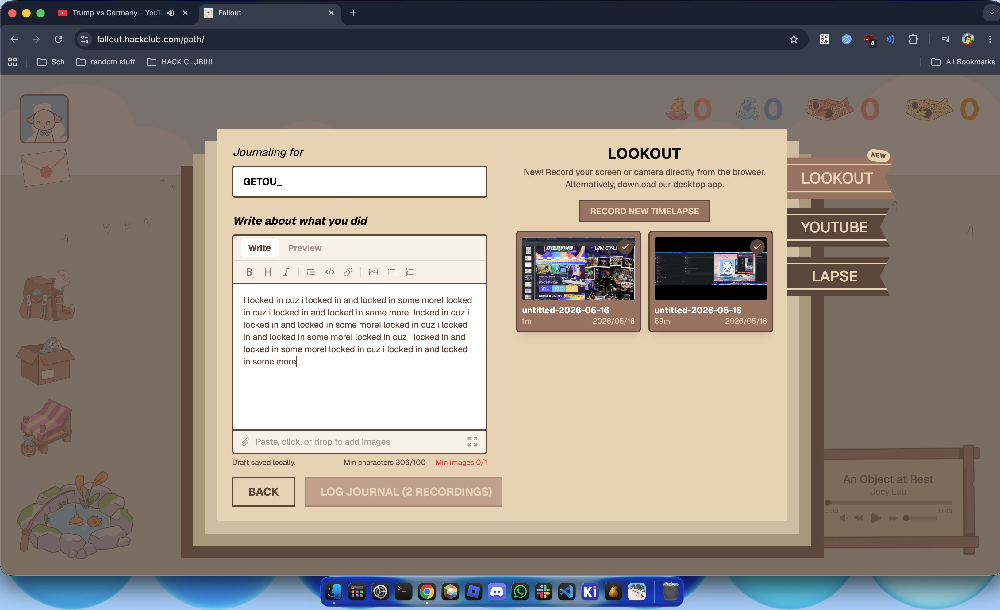

### Recordings

https://github.com/user-attachments/assets/f814c9cf-9ce5-42a1-99aa-9ea9a12aba9b

https://github.com/user-attachments/assets/76057230-05ac-4855-8547-c159fd19b0dc

## Entry 15
- ID: 7393
- Author: the rekrap2 wannabe gnahiak2 aka kaihang for my irl friends
- Created At: 2026-05-16T10:54:10Z

### Content

I did the zine and locked in I did the zine and locked in I did the zine and locked in I did the zine and locked in I did the zine and locked in I did the zine and locked in 
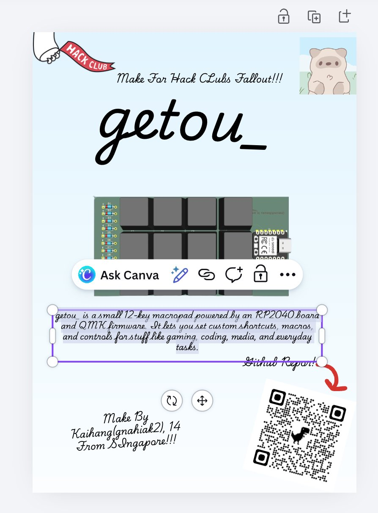

### Recording 

https://github.com/user-attachments/assets/f43cd9e3-8c47-428e-b722-fbd2b7100984

https://github.com/user-attachments/assets/954e8bd3-e4c1-4b54-a571-e1df8eb83974

## Entry 16
- ID: 7395
- Author: the rekrap2 wannabe gnahiak2 aka kaihang for my irl friends
- Created At: 2026-05-16T11:15:20Z

### Content

Resolved some problems with the BOM and the .gitignore
also locked on and locked inalso locked on and locked inalso locked on and locked inalso locked on and locked inalso locked on and locked inalso locked on and locked in
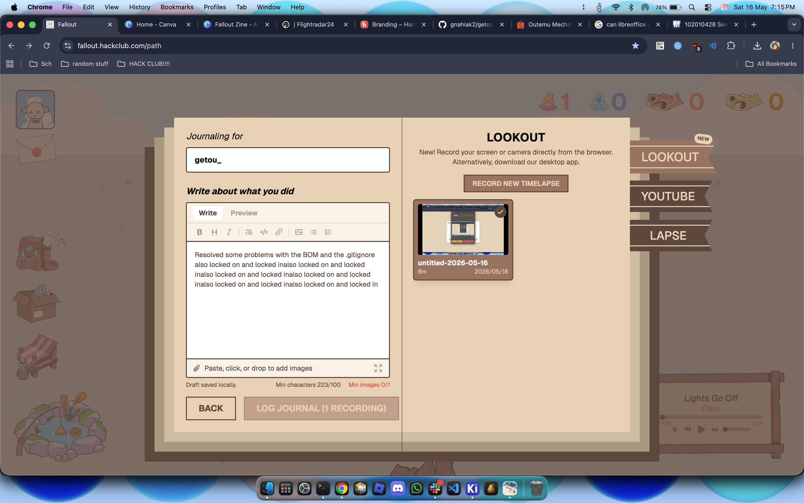

### Recording
https://github.com/user-attachments/assets/f43cd9e3-8c47-428e-b722-fbd2b7100984

## Entry 17
- ID: 7526
- Author: the rekrap2 wannabe gnahiak2 aka kaihang for my irl friends
- Created At: 2026-05-17T01:42:44Z

### Content

I improved the BOM and locked in on the Zine I also locked in and locked in i also locked in also i locked in
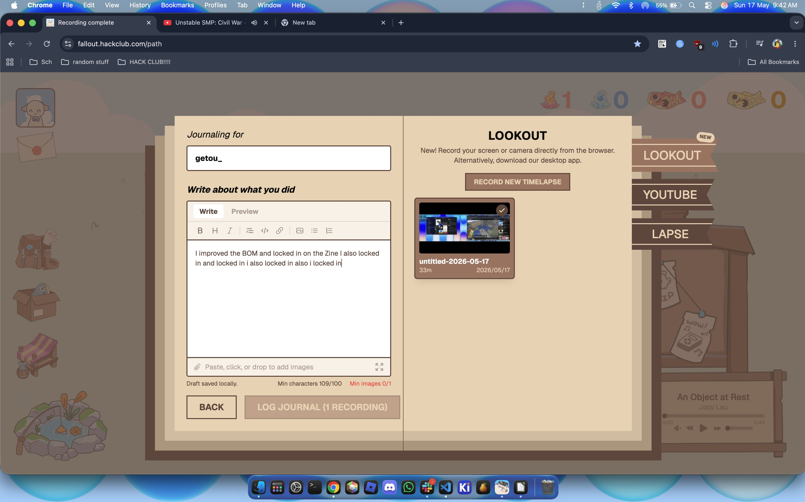

### Recording 

https://github.com/user-attachments/assets/3ba05544-26f3-4687-8043-c6b016039b7c

## Entry 18
- ID: 8788
- Author: the rekrap2 wannabe gnahiak2 aka kaihang for my irl friends
- Created At: 2026-05-24T03:52:02Z

### Content

I started on the Mac app that starts on the GUI app that allows for macros and all that to be added. I'm focusing on Mac because I use one.
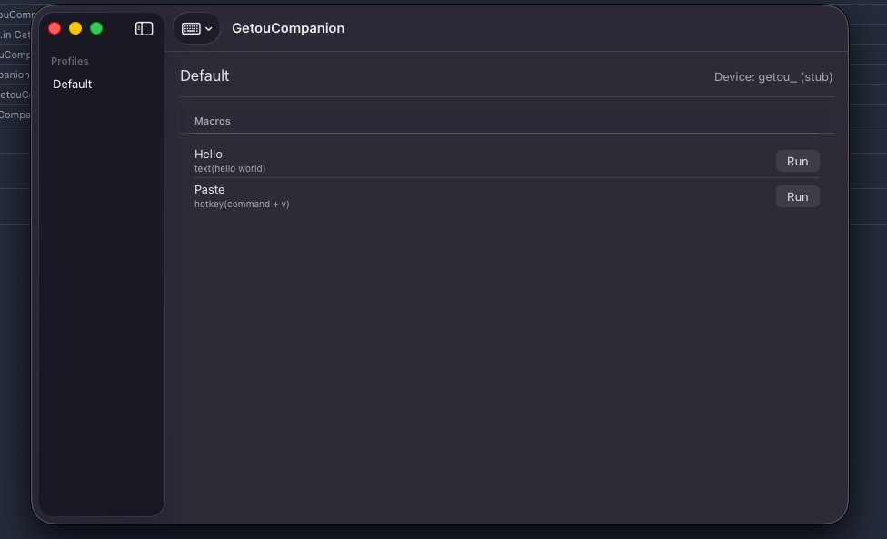

### Recording

https://github.com/user-attachments/assets/2aa5f13b-9eea-461f-8e39-0d6ac665289c

## Entry 19
- ID: 10032
- Author: the rekrap2 wannabe gnahiak2 aka kaihang for my irl friends
- Created At: 2026-05-29T02:01:22Z

### Content

I have no idea what i didI have no idea what i didI have no idea what i didI have no idea what i didI have no idea what i didI have no idea what i didI have no idea what i did
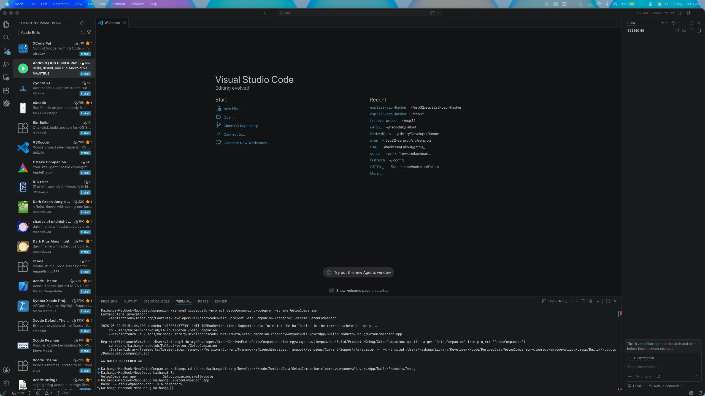

### Recording Links

https://github.com/user-attachments/assets/6a62fe59-a536-4930-953e-08cbd0ecb5c6

## Entry 20
- ID: 10309
- Author: the rekrap2 wannabe gnahiak2 aka kaihang for my irl friends
- Created At: 2026-05-30T03:51:51Z

### Content

hmmmmmmmmmmmmmmmmmmmmmmmmmmmmmmmmmmmmmmmmmmmmmmmmmmmmmmmmmmmmmmmmmmmmmmmmmmmmmmmmmmmmmmmmmmmmmmmmmmmmmmmmmmmmmmmmmmmmmmmmmmmmmmmmmmmmmmmmmmmmmmmmmmmmmmmmmmmmmmmmmmmmmmmmmmmmmmmmmmmmmmmmmmmmmmmmmmmmmmmmmmmmmmmmmmmmmmmmmmmmmmmmmmmmmmmmmmmmmmmmmmmmmmmm
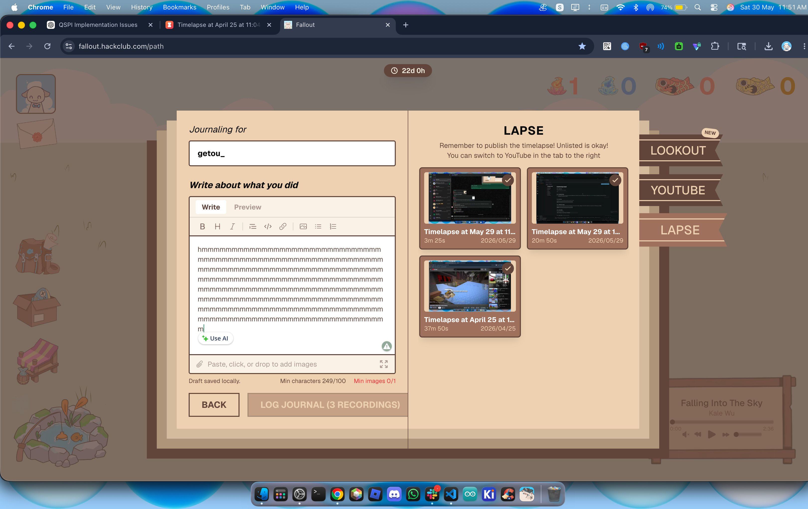

### Recordings

https://github.com/user-attachments/assets/7c75d86c-c191-4f7b-87e9-901c9cc96a4d

https://github.com/user-attachments/assets/5a662fc1-b099-4362-bc02-32b611950733

https://github.com/user-attachments/assets/a5ff7b83-ce98-43f5-be6f-0f798a98679a

## Entry 21
- ID: 10857
- Author: the rekrap2 wannabe gnahiak2 aka kaihang for my irl friends
- Created At: 2026-06-01T08:31:22Z

### Content

I made the app and errrrrrrrrrrrrrrrm i added stuff and even stuff and errrmmmmmmm i have no idea what i did
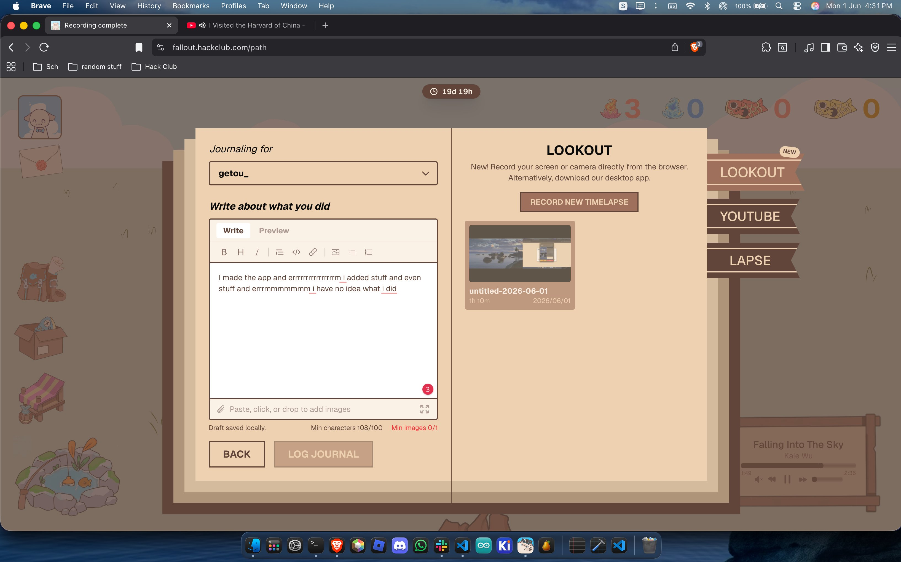

### Recording

https://github.com/user-attachments/assets/716add3b-3df4-495d-8e96-675c9a3a6aa3

