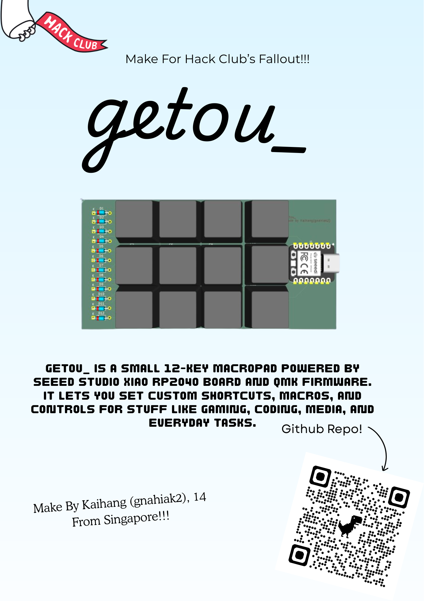
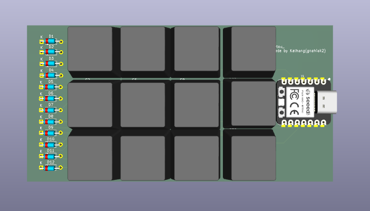
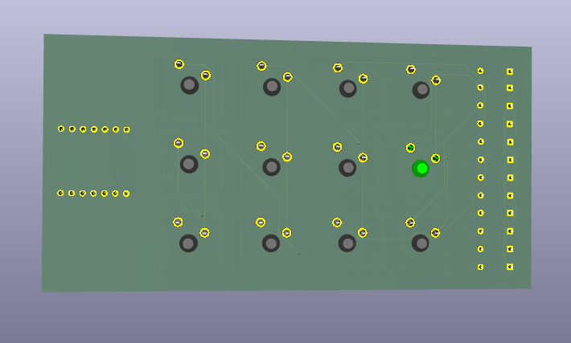
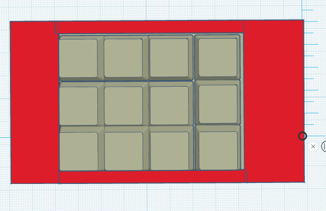

# getou_
Its pretty much a hackpad but i made it myself

Here's the Zine!
<div align="center">
  
</div>


## HOW THIS WAS MADE
Firmware was made in C via qmk, the accompanying app was made in swift with the help of chatgpt

<<<<<<< HEAD
## Here's how to compile and flash the project
1. Clone the source code to your device
```bash
git clone https://github.com/gnahiak2/getou_.git
cd getou_
```
=======
A compact fully programmable 12-key macropad powered by QMK firmware and built around the RP2040 microcontroller.


> **⚠️ Manual Horizons Review Required**
>
> This project requires manual review because the hours were originally submitted through Fallout


---

# 🧠 What is getou_?

getou_ is a custom 3×4 mechanical macropad designed to provide fast access to shortcuts, macros, media controls, and custom workflows in an ultra-compact form factor.

Built around the RP2040 platform and powered by QMK firmware, it is fully open-source and highly customizable.

Unlike many commercial macropads, getou_ is:

- fully programmable
- open hardware
- open firmware
- lightweight and compact
- easy to build and modify

The project can function as:

- a productivity macropad
- a programmable numpad
- a media controller
- a shortcut board
- a small stream deck alternative

---

# 💡 Why I made this

I wanted a macropad that was:

- small but still powerful
- fully customizable through QMK
- inexpensive to build
- easy to modify and experiment with

Many existing macropads are expensive or locked behind proprietary software ecosystems.

getou_ was created as an open alternative that anyone can build, flash, and customize.

This project also gave me experience with:

- PCB design
- keyboard matrix design
- QMK firmware
- RP2040 development
- CAD modeling
- hardware prototyping

---

# 🧩 Features

- 12-key 3×4 layout
- RP2040 based
- QMK firmware support
- Fully programmable layers/macros
- NKRO support
- USB-C connectivity
- Easy UF2 firmware flashing
- Compact custom PCB
- Open-source hardware and firmware

---

# ⌨️ Hardware

## Main Components

| Component | Description |
|---|---|
| RP2040 | Main microcontroller |
| MX-compatible switches | Mechanical keyboard switches |
| Diodes | Matrix isolation |
| USB-C connector | Power + data |
| Custom PCB | Designed in KiCad |

---

# 🖼️ Images

## Fully Assembled Macropad

![Assembled]
not yet

---

## PCB





---

## 3D Render



---

# 🔌 Firmware

The macropad uses QMK firmware.

## Building Firmware
>>>>>>> 792693256175b0cb058a5d04ba45f2815b213160

2. Compile firmware
```bash
qmk compile -kb getou_ -km default
```

3. Plug in your USB-C Cable while holding the Boot button (marked B)

4. Drag the .uf2 file into the RP2040 and you're done!


## AI DISCLOSURE
AI was used for QMK
